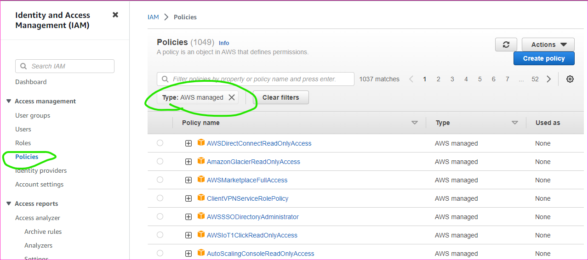

AWS Managed Policies
---------------------

* Policies given aws by default are referred as Managed Policies
* There are generic policies created and managed by aws

AWS Customer Managed Policies
-----------------------------
* These are custom policies defined by AWS Users for custom permissions.
* To create policies we need to understand
    * Service
    * Resource
    * Actions
* Lets try to give an access to testers to start and stop ec2 insatnces
    * To start and stop ec2 user should be able to view ec2 insatnces
    * The actions which we have sorted are 
        * StartInstances
        * StopInstances
        * DescribeInstances

### Try Creating an iam policy for 
* any s3 bucket read, delete
* any ec2 view and terminate the ec2 instances

Next steps
-----------
* Write policies in JSON
