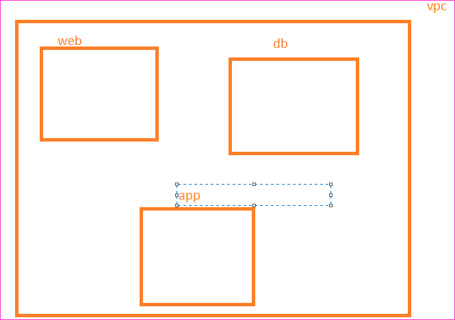

Security Groups and Network ACLs
-----------------------------------

* Security groups and Network ACLs can filter the network traffic. 
* Security group operators at network interface level, 

* Security Groups:
    * The default rule is deny all
    * Depending on what we need to allow we create rules

Network ACL
------------
* whenever a packet is sent the rules in outbound are evaluated in the order of priority

* Lets create a NACL which allows all communication within vpc and all external communication to anywhere. Allows only 22 and 80 port from anywhere
* To add subnets association to NACL we need to explicitly associate

* Ensure web subnet allows incoming
   * within vpc on any traffic
   * external sources for noly 22, 80, 443
* Ensure db and app subnets allow incoming within vpc on any traffic no external communication is allowed
  

* Lets assume we have a rule which speaks about specific ip
    * Rule IP (100.110.120.130/32)

Security Group
---------------

* We write only Allow rules
  
