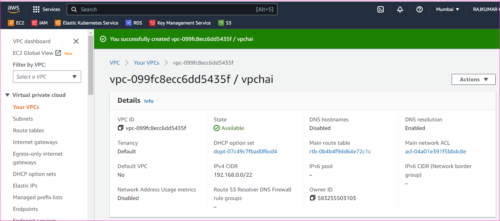

Major components of QWS Networkig are 
  * VPC
  * Subnet
  * Internet Gateway
  * Route Table
  * Network Interface
  * Elastic IP
  * Secureity Group
  * Network ACL

* VPC (Virtual Private Cloud)
    * is a virtual network which we can create in AWS
    * belongs to a region
    * we can create the private of size required by using CIDR
* Subnet:
    * AWS Subnet is subnet of VPC
    * belongs to AZ
    * We can create resources and connect to subnet
    * size is expressed in CIDR
* Internet Gateway:
    * This gives dual connectivity i.e. vpc can access internet and inetrnet can access resources in vpc using public ip addressing
    * If you want 

