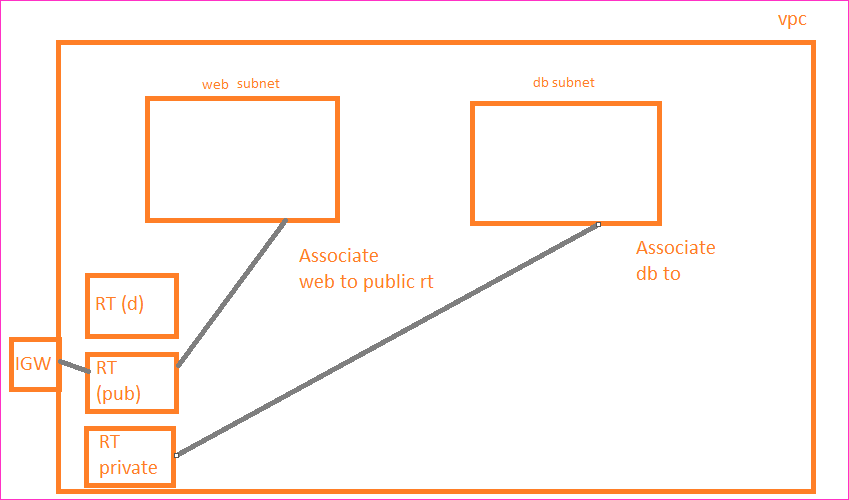

Public and Private Subnets
----------------------------

* Public Subnet is associate with a router which has route to internet gateway
* Private subnet is associated with a aroute table which has no route to internet gateway
* subnets will using
    * default route table, if there is no explicit connection 

* Lets create a vpc with 3 subnets
  
* Lets create an ec2 instance in public subnet (we have not associated public subnet to public route table yet)
* Now lets try ssh connectivity using public ip 
* Lets associate public subnet to public rt
* Lets try to reconnect
* Now lets try to connect to internet from public ec2
* Lets try to connect one ec2 instance in private subnet which is explicitly connected to private to private route table
* Now connecting to private route table instance using public ip
* For all the insternal communications in vpc use private ips not public ip.
* Lets try to connect to insternet from private ec2
* Private subnets cannot be connected 
  