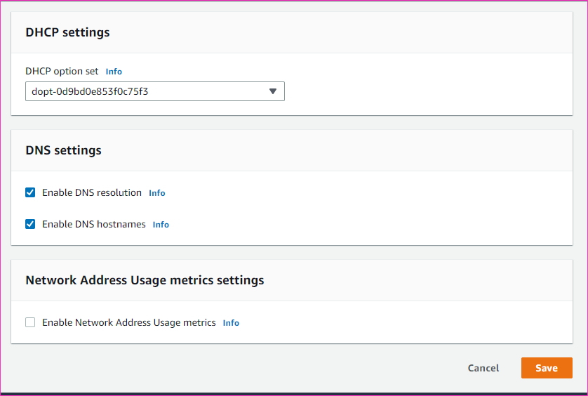
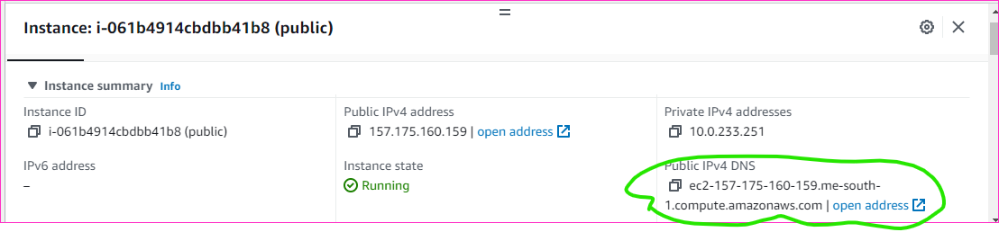
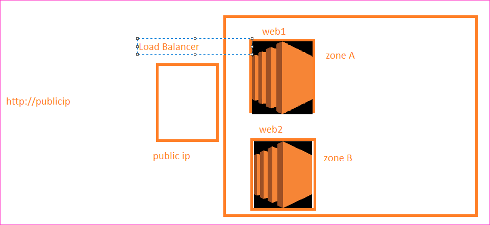
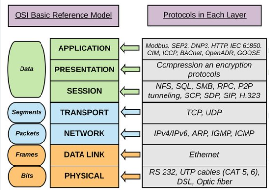

AWS Networking Workshop
------------------------

* Create vpc with atleast one 






### DHCP Options Set
* DHCP Option set is used to set the DNS Servers in VPC

### Create an ec2 instance with some predefined private ip.

* Create a Network interface in the subnet (zone) where your ex2 instance is running.
* Choose Custom for private ip address
* Attach this network interface to your ec2 instance


### Lab Prep
* Create an ec2 instance and ensure you execure the following steps 
```
sudo apt update
sudo apt install apache2 stress -y
sudo apt install php libapache2-mod-php php-mysql -y
sudo -i 
echo "<?php phpinfo(); ?>" > /var/www/html/info.php
```

* Navigate to `http://publicip/info.phpq`

* Create an AMI
* wait till the AMI create is completed
* Delete the ec2 instance





### Load Balancing

#### OSI Model of Networking
* Layers and Protocols
   
#### Layer 4 and Layer 7 LoadBalancing
* Load Balancing can be done at Layer 4 and 7 
* Layer 4:
    * Aware: IP, Port, TCP/UDP, MAC
* Layer 7:
    * Aware: IP, Port, TCP/UDP, MAC, HTTP, SSL/TLS (security)

#### Aws Options Load Balancing in Single Region
#### Load Balancers in AWS 
* In AWS we 

#### Multi Region


### DNS in AWS
#### Layer 4 load balancing
* Create a VPC with two subnets in two different zones
* Create ec2 instance in subnet 1 and subnet 2
* Ensure 80 port and 22 port are enable
* 


   * Interval: how frequently load balancer will perform health checks?
   * Healthy threshold: How many consecutive health checks should be failed to consider the instance unhealthy
* 
#### Lab Detup for Next Set of Activity 
* We have AMI in a region, lets copy that to other region
* Create a vpc with two public subnets and create web1 and web2 in the other region as well  

#### Create 


DNS servers are used to store records mapping domain/host names to ip addresses
Every system has a local DNS record
    Windows: `c:\windows\system32\drivers\etc\hosts`
    Linux `/etc/hosts`
* Servers which store these records are called as Name Servers 
* DNS Servers which are used for public 

Note: 
  * The smallest subnet in AWS is /28 and largest subnet is /8


