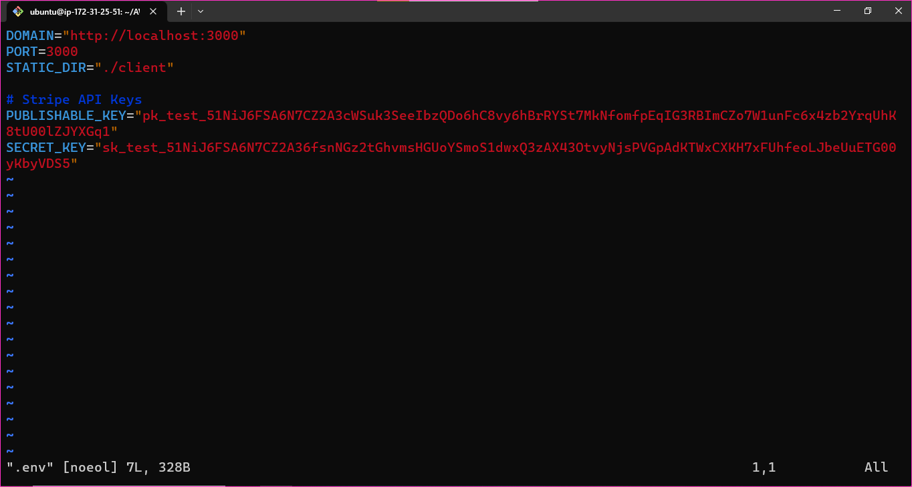

# AWS-Session
This repository for deploying Nodejs application in AWS

Deploying a Node Js application on AWS EC2
-------------------------------------------
### First Test the code locally
* Clone this repository
```
git clone hppts://github.com/aarkay.gummadi/AWS-Session
```
* Setup the following environment variables - `.env` file
  [Refer Here](https://github.com/aarkay-gummadi/AWS-Session/commit/d6c8613a6621b7bbe959eb739350fc61b7d437dd) for the `.env` file
```
DOMAIN=""
PORT=3000
STATIC_DIR=""

# Stripe API Keys
PUBLISHABLE_KEY=""
SECRET_KEY=""
```
* How we will get the above Stripe API Keys 
  

* Initialize and start the project  
```
npm install
npm run start
```


### Setup an AWS EC2 Instance

* Create EC2 Instances in AWS Cloud, for that login into AWS Console
* After login the console, go to IAM Service   
  
* Create a user called `aarkay`, and give a policy to user i.e `AdministratorAccess`, and start creating ec2 instance.
  
  
  
  
  
  
* Wait untill the instance is Running state, and copy the public ip address and login to machin with the help of git(terminal).
  
  
* Configure the Instance using ssh
```
ssh -i "aarkay.pem" ubunutu@<Public-ip Address>
```
  

* Update the outdated packages and dependencies
```
sudo apt update
sudo apt install nodejs -y
node -v
sudo apt install npm -y
npm -v
```


* Clone project to this ec2 instance
```
git clone https://github.com/aarkay-gummadi/AWS-Session.git
```


* Setup the following environment variables - .env file   
[Refer Here](https://github.com/aarkay-gummadi/AWS-Session/commit/d6c8613a6621b7bbe959eb739350fc61b7d437dd) for the .env file.
* For that to run the following commands
```
cd AWS-Session
touch .env
vi .env
ls -a
```



* Run the following commands
```
npm install
npm run start
```


* Project deployed on AWS Successfully

### Thanks for Reading! 
 Have a Nice Day

