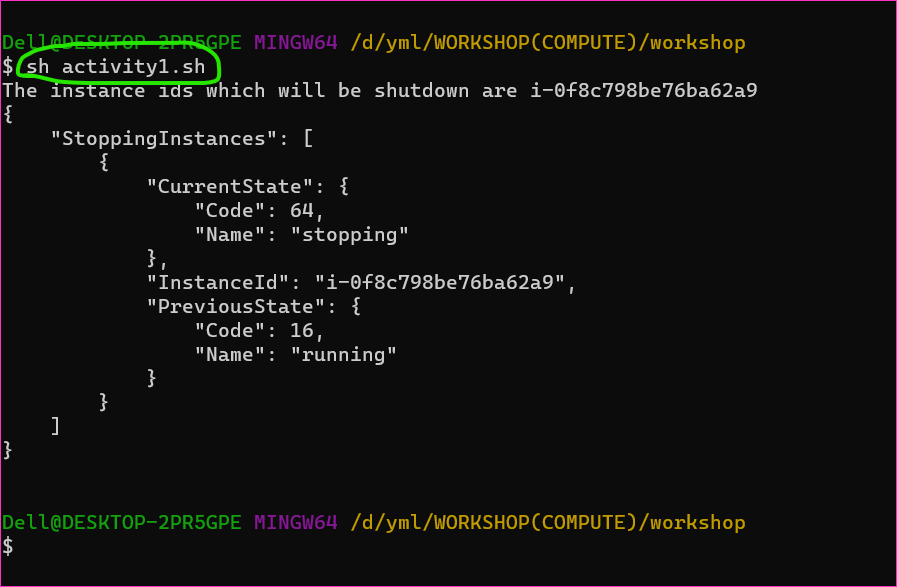
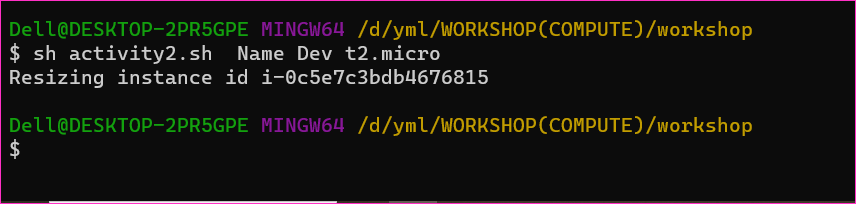
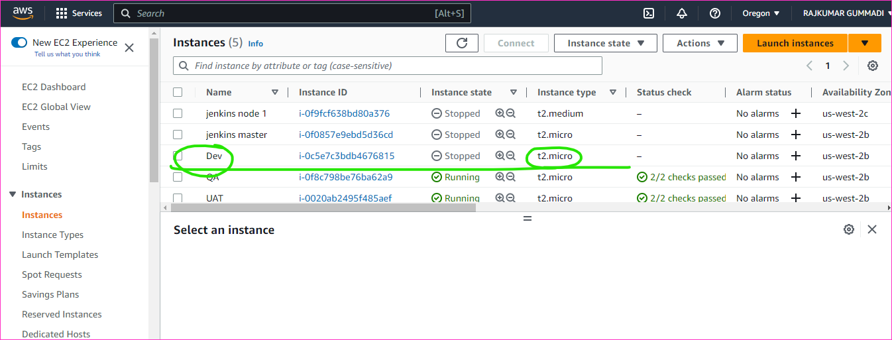

Compute - Workshop
--------------------

* Areas of Focus
   * Automation
   * Administration


### Activity 1: Shutdown all instances which have tag Env=QA

* Setup: Create 3 ec2 instances of free tier and provide tags 
    * Machine 1: Env: Dev
    * Machine 2: Env: QA
    * Machine 3: Env: UAT

This script was failing if there are no instances matchig criteria, so we add a flag or condition
* Improvement 2: Make this script work for tag Env=Dev

```sh
#!/bin/bash
tag_name=$1
tag_value=$2
# if user doesnot pass tag_name as 1 argument assign Env as default
if [[ -z $tag_name ]]; then
    tag_name="Name"
fi
# if user doesnot pass tag_value as 2 argument assign QA as default
if [[ -z $tag_value ]]; then
    tag_value="QA"
fi

instanceIds=$(aws ec2 describe-instances --filters "Name=tag:${tag_name},Values=${tag_value}" "Name=instance-state-name,Values=running" --query "Reservations[].Instances[].InstanceId" --output text)

if [[ -n $instanceIds ]]; then
    echo "The instance ids which will be shutdown are ${instanceIds}"
    aws ec2 stop-instances --instance-ids ${instanceIds}
else
    echo "No instances found with matching criteria ${tag_name} = ${tag_value}"
fi
```

### Activity 2: Resize the EC2 instance from t2.micro to t2.nano based on tags
```sh
#!bin/bash

# This function will set the default value to the first argument if it is empty
function set_default_if_empty() {
    value=$1
    # if user doesnot pass default value as 1 argument assign second argument as default
    if [[ -z $value ]]; then
        value=$2
    fi
    echo $value
}

# This function gets instance ids by tags
function get_instance_ids_by_tags() {
    tag_name=$(set_default_if_empty $1 Name)
    tag_value=$(set_default_if_empty $2 QA)
    instanceIds=$(aws ec2 describe-instances --filters "Name=tag:${tag_name},Values=${tag_value}" --query "Reservations[].Instances[].InstanceId" --output text)
    echo $instanceIds
}

instance_type=$(set_default_if_empty $3 t2.nano)


# get instance ids based on tags
instance_ids=$(get_instance_ids_by_tags $1 $2)
for instance_id in $instance_ids
do
    echo "Resizing instance id ${instance_id}"
    aws ec2 modify-instance-attribute --instance-id $instance_id --instance-type ${instance_type}
done
```




### Activity 3: EC2 Systems Manager

* Systems Manager can be used to control linux or window workloads in 
    * AWS 
    * Other Cloud Providers
    * On-Premises
    * IOT

### Setting up Systems Manager
* Navigate to Systems Manager
* Now Create an Instance Profile
* AWS Recommends using Configure Default